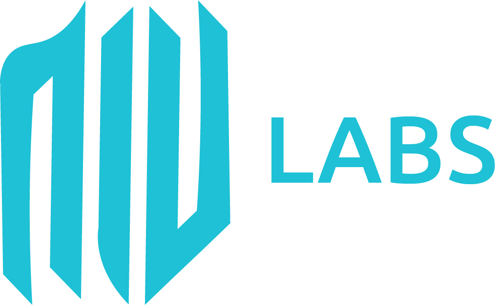

<h1 align="center">
  
</h1>
<h2 align="center">
  FT - Gestão de Prontuário - UI
</h2>

O FT - Gestão de Prontuário - UI (FTGP-UI) é uma UI RestClient OpenSource criada inicialmente como doação para hospitais que não possuem nenhuma solução de automação no processo de prontuário. O FTGP-UI é integrado com uma API baseado em Java, o [FTGP-API](https://github.com/viniciosarodrigues/gestao-de-prontuario).

    
    
    
    

Atualmente encontra-se na versão 1.0.0 em desenvolvimento - [FTGP-UI](https://gestao-prontuario-ui.herokuapp.com/)

---

  
  
  
  

---

## Como densenvolver?
Para contribuir com o projeto, existem alguns requisítos mínimos de configurações, são eles?
- Node 10 + **(Obrigatório)**
- Angular 9 (Community) **(Obrigatório)**
- Qualquer editor de texto *(Opcional)*

---

## Como rodar a UI?
Por ser um projeto Angular 8, não se faz necessário o uso de nenhum servidor externo, pois o framework já disponibiliza um Node Server embarcado, desta forma basta usar o comando **ng serve** -> **ng serve -port 9090** para rodar em porta específica.

---

## Como contribuir
Caso queira contribuir, basta realizar um fork do repositório, fazer a implementação desejada, **criar uma issue de push** e realizar pull request para a **master**.

---

## Contato
Qualquer dúvida ou sugestão, favor enviar para o e-mai *viniciosarodrigues@gmail.com* ou enviar mensagem privada pelo próprio GitGub.

---

## 📝 License

Este projeto é licenciado por MIT License - Veja a licença no arquivo [LICENSE](LICENSE) para mais detalhes.

---