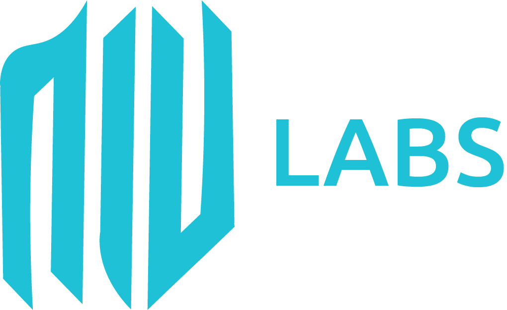

<h1 align="center">
  
</h1>
<h2 align="center">
  CliNiv - UI
</h2>

CliNiv - UI é uma UI RestClient criada inicialmente como doação para hospitais que não possuem nenhuma solução de automação no processo de prontuário. O CLINIV-UI é integrado com uma API baseado em Java, o [CLINIV-API](https://github.com/niv-labs/cliniv-api).

    
    

Atualmente encontra-se na versão 1.0.0 em desenvolvimento - [CLINIV-UI](http://app.nivlabs.com.br)

---

  
  
  
  

---

## Índice

<ul>
  <li><a href="#mínimo-para-rodar">Mínimo para rodar</a></li>
  <li><a href="#como-rodar-a-aplicação">Como rodar a aplicação?</a></li>
  <li><a href="#como-contribuir">Como contribuir?</a></li>
  <li><a href="#contato">Contato</a></li>
  <li><a href="#-license">License</a></li>
</ul>

---

## Mínimo para rodar
Para contribuir com o projeto, existem alguns requisítos mínimos de configurações, são eles?
- Node 18 + **(Obrigatório)**
- Angular 14 (Community) **(Obrigatório)**
- Qualquer editor de texto *(Opcional)*

---

## Como rodar a aplicação?

### Passo 1

- 👯 Clone este repositório na sua máquina local usando `https://github.com/niv-labs/cliniv-ui.git`

### Passo 2

- 📌 Instale as dependências do projeto usando o comando `npm i`

### Passo 2

- 🔃 Rode a aplicação usando o comando `ng serve` e acesse a porta padrão 4200. Caso queira rodar em outra porta, adicione o argumento `-port PORTA_DESEJADA`, ex: `ng serve -port 8080`

---

## Como contribuir

### Passo 1

- 🍴 Realize um Fork deste respositório!

### Passo 2

- 👯 Clone este repositório na sua máquina local usando `https://github.com/niv-labs/cliniv-ui.git`

### Passo 3

- 🎋 Crie sua branch de funcionalidade usando `git checkout -b minha-funcionalidade`

### Passo 4

- ✅ Realize o commit de suas alterações usando `git commit -m 'feat: Minha nova funcionalidade'`;

### Passo 5

- 📌 Realize o push para a branch usando `git push origin minha-funcionalidade`;

### Passo 6

- 🔃 Crie um novo pull request

Depois que seu Pull Request é aceito e o merge é realizado, você pode deletar a sua branch de funcionalidade.

---

## Contato

> Você pode me encontrar por aqui...

- NiV Labs      :: [NiV Labs](http://www.nivlabs.com.br)
- Atendimento   :: [atendimento@nivlabs.com.br](atendimento@nivlabs.com.br)
- Vinícios (eu) :: [viniciosrodrigues@nivlabs.com.br](viniciosrodrigues@nivlabs.com.br)

---

## 📝 License

Este projeto é licenciado por MIT License - Veja a licença no arquivo [LICENSE](LICENSE) para mais detalhes.

---